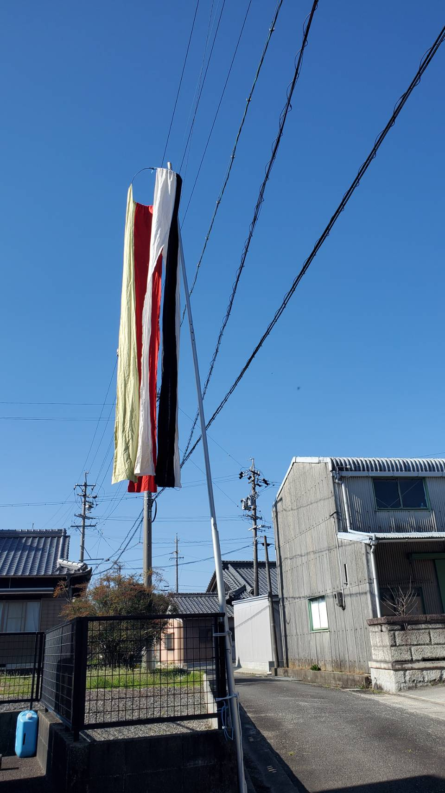
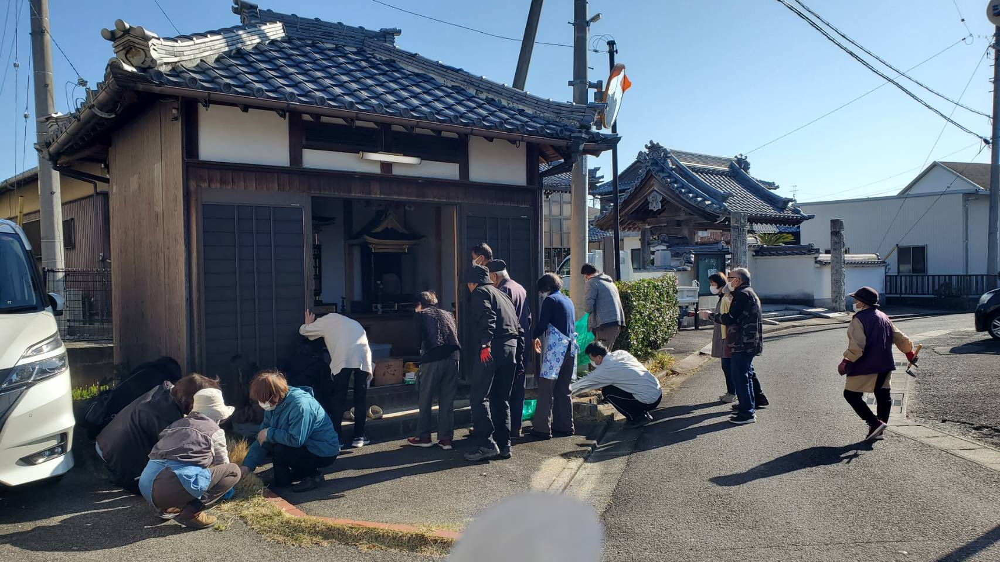
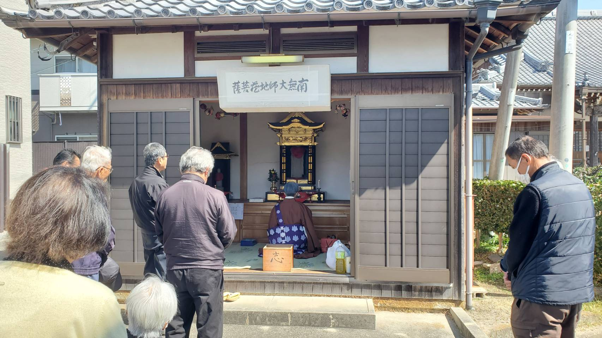
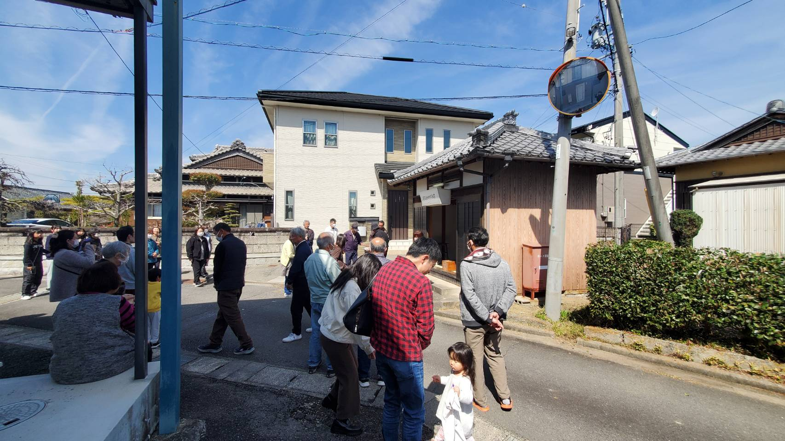

# 活動報告：地蔵堂祭の開催

開催日：2026年3月24日
場所：安塚町北組 欣念寺西地蔵堂

2026年3月24日に、安塚町にて「地蔵堂祭」が開催されました。

## 地蔵堂祭について
皆さんは「地蔵堂祭」をご存知でしょうか？ 実は私はこれまで知りませんでした。

地蔵堂祭とは、「地域を守ってくれるお地蔵様（地蔵菩薩）への感謝と、子供たちの健やかな成長を願うお祭り」です。
お地蔵様と特に縁が深い日は「毎月24日」と決まっています。安塚町をはじめ、三重県や近畿地方の一部では、春の訪れを感じる3月に「春の地蔵」としてお祭りを行う伝統があり、毎年この時期に春のお地蔵様の縁日に合わせて開催しています。

## 朝からの準備
当日の朝早くから、担当組の皆様が掃除や飾りつけを行ってくれました。
おかげさまで、綺麗に整えられた心地よい空間でお祭りを迎えることができました。

## 読経とお参り
10:30からはお坊さんにお越しいただき、読経が行われました。
地域の平安と子供たちの無病息災を願い、お祭りに関わる皆で静かに手を合わせました。

## 子供たちの健やかな成長を願って
最後には、お菓子配り（お接待）を行いました。
お地蔵様にお供えしたお菓子を子供たちに配り、これからも健やかに元気に育つようにと、地域の願いを込めました。

## ご協力に感謝申し上げます
当日の運営や準備にご協力いただいた皆様、誠にありがとうございました。心より感謝申し上げます。

今回組長として地蔵堂祭に参加し、このような風習があるということを初めて知りました。とても良い経験となりました。
これを機に、皆様もぜひお近くを通る際はお地蔵さまに手を合わせてみてはいかがでしょうか？

> **注記：** この報告書に使用している写真は、当日撮影したものです。プライバシー等に配慮しておりますが、掲載に差し障りがある場合はご連絡ください。
