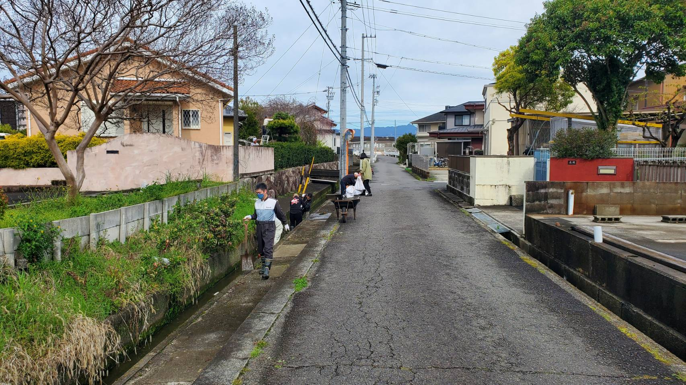
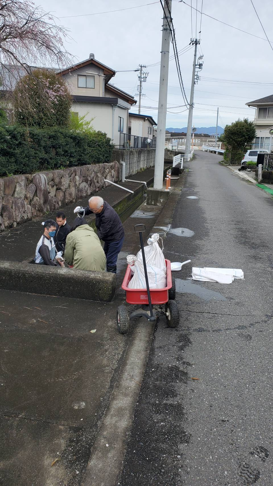
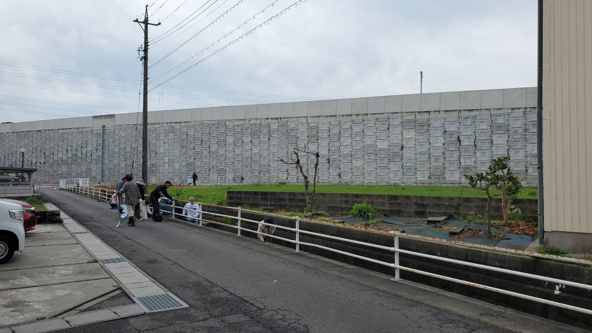
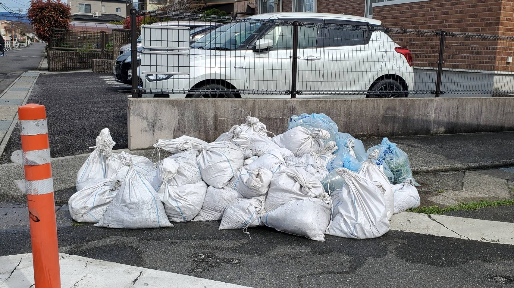

# 活動報告：春の家庭排水溝清掃

開催日：2026年4月5日
場所：安塚町 用水路

2026年4月5日に、「春の家庭排水溝清掃」が実施されました。

## お天気に恵まれました！
皆様の日ごろの行いが良いおかげで、前日まで降っていた雨もすっかりと上がり、暑すぎず寒すぎずのちょうど良い気候のなかで排水溝清掃を行うことができました！

## 精力的な清掃作業に感謝申し上げます
朝早くから、本当に多くの方にご参加いただき、どうもありがとうございました！
毎回のことながら、皆様がとても精力的に掃除をしてくださり、大変感謝しております。

## 綺麗になった排水溝で安心の生活を
おかげさまで、無事に滞りなく家庭排水溝清掃が完了いたしました！
作業後には、泥が詰まった多くの土嚢袋と、刈り取った草のゴミ袋が集まりました。排水溝がとてもきれいになり、これからの季節も安心して生活できますね！

## 皆様への感謝と次回のお知らせ
今回ご協力いただいた皆様、改めて本当にありがとうございました！

次回、「秋の家庭排水溝清掃」は **11月1日** を予定しております。
引き続きご協力を賜りますよう、ぜひご予定を空けておいていただけますと幸いです。よろしくお願いいたします！

> **注記：** この報告書に使用している写真は、当日撮影したものです。プライバシー等に配慮しておりますが、掲載に差し障りがある場合はご連絡ください。
